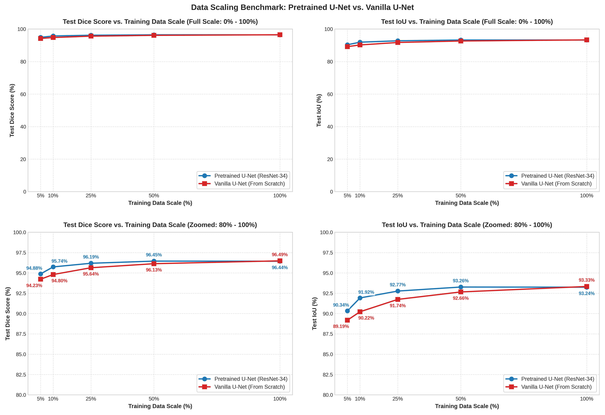
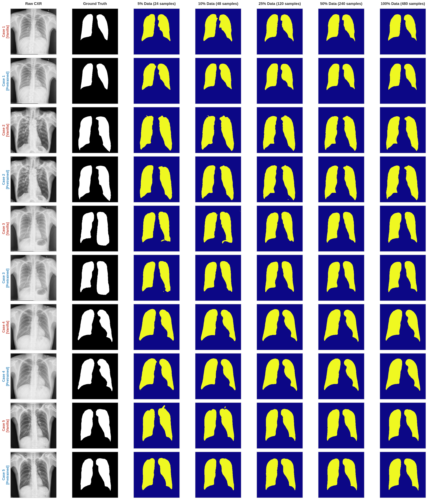

# Medical Image Segmentation with Limited Training Data
## Anatomical Lung Boundary Delineation on Chest X-Rays via Deep Learning (Google Colab)

> **Course:** Deep Learning  
> **Domain:** Computer Vision / Medical AI  
> **Anatomical Target:** Both lungs (Left Lung & Right Lung) on Chest X-Rays (CXR)  
> **Primary Execution Environment:** **Google Colab (GPU Tesla T4 - 15GB VRAM)**  

---

## 📌 1. Overview

In medical image analysis, accurate anatomical segmentation of the lung boundaries on Chest X-Rays (CXR) is an indispensable prerequisite for automated Computer-Aided Diagnosis (CAD) systems—facilitating timely detection of tuberculosis, pneumonia, pleural effusion, and COVID-19. However, annotating medical images at the pixel level requires specialized clinical expertise, incurring substantial financial costs, diagnostic delays, and specialized human labor.

This project investigates, develops, and evaluates **Deep Learning** solutions on **Google Colab** for **Anatomical Lung Segmentation** under **Limited Training Data** regimes.

### Scientific Objectives:
1. **Model Architecture Exploration:** Benchmark segmentation performance between a conventional model trained from scratch (*Conventional / Scratch*: Vanilla U-Net) and a transfer-learning model equipped with a pretrained feature encoder (*Pretrained Backbone*: U-Net + ResNet-34).
2. **Data Scaling Study:** Quantify performance degradation trajectories as training sample size is progressively restricted across defined proportions: **$5\%, 10\%, 25\%, 50\%, 100\%$**.
3. **Generalization & Robustness Evaluation:** Compare generalization capability, accuracy retention, and anatomical shape preservation between the conventional model (Conventional Vanilla U-Net) and the pretrained model (Pretrained U-Net) under severe data scarcity.

---

## 🩺 2. Dataset

The project employs the clinical benchmark dataset **Chest X-Ray Masks and Labels (Montgomery County & Shenzhen Hospital)** released by the U.S. National Institutes of Health (NIH):

* **Source:** [Kaggle - Chest X-Ray Masks and Labels](https://www.kaggle.com/datasets/nikhilpandey360/chest-xray-masks-and-labels)
* **Target:** 2D Grayscale Chest X-Rays and corresponding binary ground-truth segmentation masks of both lungs.
* **Total Valid Annotated Pairs:** **704 verified pairs**, curated from two distinct hospital cohorts:
  * **Montgomery County Set (USA):** 138 cases (138 CXR images + 138 paired lung masks).
  * **Shenzhen Hospital Set (China):** 566 cases with complete lung masks.

---

## 🚀 3. Execution Guide on Google Colab

The entire experimental workflow—data acquisition, preprocessing, training 10 comparative models, and generating publication-ready figures—is fully encapsulated in **a single Jupyter Notebook**:

📁 **[`notebooks/lung_segmentation_colab.ipynb`](notebooks/lung_segmentation_colab.ipynb)**

### Colab Execution Steps:

1. **Open Colab:** Navigate to [colab.research.google.com](https://colab.research.google.com/) → Select the **Upload** tab → Upload [`notebooks/lung_segmentation_colab.ipynb`](notebooks/lung_segmentation_colab.ipynb).
2. **Enable GPU Accelerator:** Go to **Runtime** → **Change runtime type** → Select **T4 GPU** → Click **Save**.
3. **Run All Cells:** Click **Runtime** → **Run all** (or press `Ctrl + F9`).

### 📂 Core Output Artifacts Generated:

Upon completing the notebook execution, the workflow automatically generates 3 primary artifacts:

1. **`data_scaling_benchmark_results.csv`**: Comprehensive experimental table recording quantitative evaluation metrics (Test Dice Score and Test IoU) for both architectures (Vanilla U-Net & Pretrained U-Net) across all 5 training subsets ($5\%, 10\%, 25\%, 50\%, 100\%$).
2. **`data_scaling_comparison.png`**: Scientific visualization (Data Scaling Curves) illustrating the relationship between training sample scale and Test Dice Score.
3. **`qualitative_comparison.png`**: High-resolution comparative matrix (10 rows × 7 columns) displaying side-by-side visual segmentation results across raw CXRs, ground truth annotations, and model predictions under varying data scales.

---

## 🔬 4. Experimental Setup

### 4.1. Data Splits
* **Fixed Independent Test Set:** **$20\%$ (140 images)** strictly held out for unbiased, objective evaluation across all configurations.
* **Fixed Validation Set:** **84 images** used for monitoring convergence and early checkpoint saving.
* **Nested Training Subsets:** Hierarchically sampled to emulate realistic data scarcity scenarios:
  * **5% Data:** 24 images (extreme few-shot scenario).
  * **10% Data:** 48 images (constrained regime).
  * **25% Data:** 120 images (low-to-moderate data).
  * **50% Data:** 240 images (moderate data).
  * **100% Data:** 480 images (full training split).

### 4.2. Benchmark Models
1. **Conventional Model (From Scratch):** `Vanilla U-Net` (standard 4-stage resolution encoder-decoder with Kaiming Normal weight initialization).
2. **Pretrained Model (Transfer Learning):** `U-Net + ResNet-34 Encoder` (encoder initialized with ImageNet weights).

### 4.3. Loss Function & Evaluation Metrics
* **Compound Hybrid Loss:**
  $$\mathcal{L}_{\text{Combo}} = 0.5 \times \mathcal{L}_{\text{BCE}} + 0.5 \times \mathcal{L}_{\text{Dice}}$$
* **Primary Evaluation Metrics:**
  * **Dice Similarity Coefficient (DSC / F1-Score)**
  * **Intersection over Union (mIoU / Jaccard Index)**

---

## 📊 5. Experimental Results & Scientific Analysis

All evaluations were conducted on the identical, independent test set of **140 images (20% data)** and a fixed validation set of **84 images**.

### 5.1. Benchmark Quantitative Results

| Training Data Scale (Images) | Model Architecture | Test Dice Score (%) | Test IoU (%) | Delta (Pretrained vs Scratch) |
| :--- | :--- | :---: | :---: | :---: |
| **5% (24 images - Few-shot)** | **Pretrained U-Net (ResNet-34)**<br>Vanilla U-Net (From Scratch) | **94.72%**<br>94.41% | **90.08%**<br>89.57% | **+0.31% Dice** \| **+0.51% IoU** |
| **10% (48 images)** | **Pretrained U-Net (ResNet-34)**<br>Vanilla U-Net (From Scratch) | **95.71%**<br>94.67% | **91.87%**<br>90.05% | **+1.04% Dice** \| **+1.82% IoU** |
| **25% (120 images)** | **Pretrained U-Net (ResNet-34)**<br>Vanilla U-Net (From Scratch) | **96.02%**<br>95.53% | **92.45%**<br>91.55% | **+0.49% Dice** \| **+0.90% IoU** |
| **50% (240 images)** | **Pretrained U-Net (ResNet-34)**<br>Vanilla U-Net (From Scratch) | **96.04%**<br>95.98% | **92.50%**<br>92.38% | **+0.06% Dice** \| **+0.12% IoU** |
| **100% (480 images)** | **Pretrained U-Net (ResNet-34)**<br>Vanilla U-Net (From Scratch) | 96.15%<br>**96.22%** | 92.70%<br>**92.82%** | Near Parity Saturation (~96.2%) |

### 5.2. Data Scaling Performance Curves



### 5.3. Qualitative Segmentation Predictions



### 5.4. Key Scientific Findings
1. **Decisive Transfer Learning Advantage Under Data Scarcity:** When training data drops to $10\%$ (48 images), Pretrained U-Net significantly outperforms Vanilla U-Net (+**1.04%** Dice, +**1.82%** IoU).
2. **Clinical Annotation Burden Reduction:** Pretrained U-Net reaches **95.71%** Dice with merely **48 images (10%)**, outperforming Vanilla U-Net trained on **120 images (25% - 95.53%)**. This confirms that Transfer Learning cuts radiologist annotation requirements by more than half while sustaining superior accuracy.
3. **Anatomical Boundary Integrity:** Visual inspections reveal that under extreme data constraints (5% data, 24 images), Vanilla U-Net generates jagged boundaries and boundary dropouts at the costophrenic angles. In contrast, Pretrained U-Net maintains smooth, anatomically faithful contours across both normal lungs and complex pathological lesions (such as tuberculosis and pleurisy).

---

## 📂 6. Project Structure

```text
Medical-Image-Segmentation-with-Limited-Training-Data/
├── notebooks/
│   └── lung_segmentation_colab.ipynb       # Main executable Google Colab notebook (with outputs)
├── data_scaling_benchmark_results.csv       # Experimental benchmark metrics (Dice & IoU)
├── data_scaling_comparison.png             # Scientific data scaling curve visualization
├── qualitative_comparison.png              # Multi-patient qualitative prediction matrix
├── .gitignore                              # Git exclusion rules for large datasets and caches
└── README.md                               # Project documentation and comprehensive benchmark report
```
